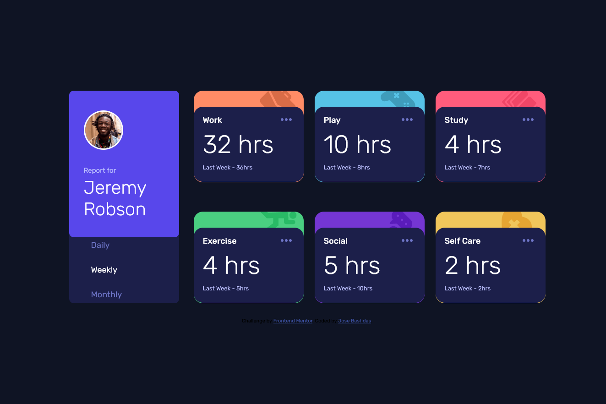
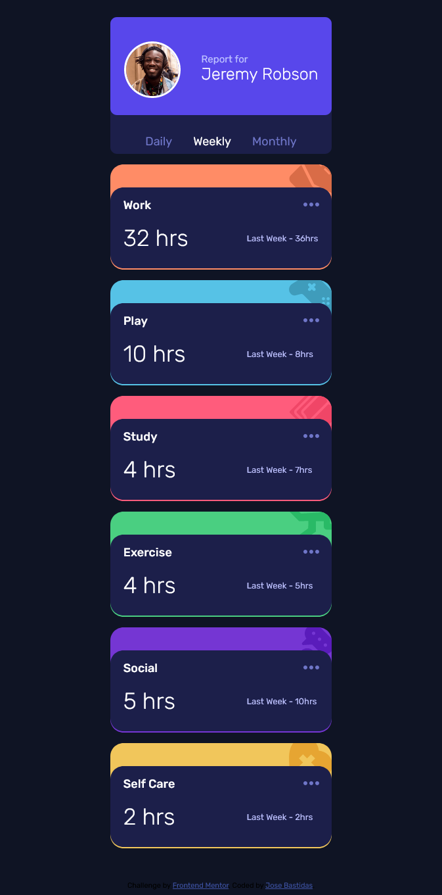

# Frontend Mentor - Time tracking dashboard solution

This is a solution to the [Time tracking dashboard challenge on Frontend Mentor](https://www.frontendmentor.io/challenges/time-tracking-dashboard-UIQ7167Jw). Frontend Mentor challenges help you improve your coding skills by building realistic projects. 

## Table of contents

- [Overview](#overview)
  - [The challenge](#the-challenge)
  - [Screenshot](#screenshot)
  - [Links](#links)
- [My process](#my-process)
  - [Built with](#built-with)
  - [What I learned](#what-i-learned)
  - [Continued development](#continued-development)
- [Author](#author)

## Overview

### The challenge

Users should be able to:

- View the optimal layout for the site depending on their device's screen size
- See hover states for all interactive elements on the page
- Switch between viewing Daily, Weekly, and Monthly stats

### Screenshot



Screenshot of the project on computer resolution



Screenshort of the project on movil

### Links

- Solution URL: [Time Tracking Dashboard](https://jb-hb.github.io/Code-Challenges/time-tracking-dashboard-main/)

## My process

### Built with

- Semantic HTML5 markup
- CSS custom properties
- Flexbox
- JavaScript

### What I learned

Something I had never used was the svg images, in this challenge I learn a lot about them and how usefull are for the front end development. 

```html
<svg class="points" xmlns="http://www.w3.org/2000/svg" height="36px" viewBox="0 0 24 24" width="36px" fill=" hsl(235, 45%, 61%)" cursor='pointer'><path d="M0 0h24v24H0V0z" fill="none"/><path d="M6 10c-1.1 0-2 .9-2 2s.9 2 2 2 2-.9 2-2-.9-2-2-2zm12 0c-1.1 0-2 .9-2 2s.9 2 2 2 2-.9 2-2-.9-2-2-2zm-6 0c-1.1 0-2 .9-2 2s.9 2 2 2 2-.9 2-2-.9-2-2-2z"/></svg>
```
```js
var puntos = document.querySelectorAll('.points');
puntos.forEach(punto => {
        punto.addEventListener('mouseover',()=>{
            punto.setAttribute('fill','#FFFFFF')
        })
        punto.addEventListener('mouseout',()=>{
            punto.setAttribute('fill','hsl(235, 45%, 61%)')
        })
    })
}
```

### Continued development

For future projects I will used more de svg images, I will use CSS Grid for duture projects, using only flexbox was a resizing nightmare. 
Other thing I am going to practice more is the use of .json files, because in this challenge I was not able to fetch the data from the file and end up copy pasting the content of the file in the Script file. (if some one knows how to do it please send me an email explaining the process) 

## Author

Jose Bastidas
- Gmail - [jbhbprograming@gmail.com]
- Linkedin - [Jose Bastidas](www.linkedin.com/in/josé-bastidas-b48759221)
- Frontend Mentor - [@JB-hb](https://www.frontendmentor.io/profile/JB-hb)
